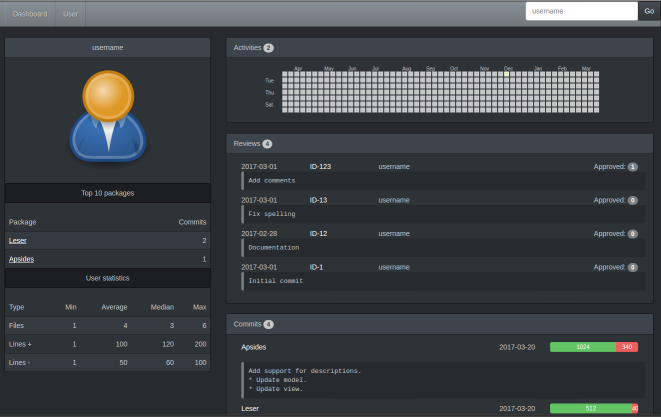

# Apsides - yet another team dashboard.

It's a test project to get an idea of elm as a language.



## Build

````````````````````````````````````````````````````````````````````````````````

$ elm make src/Main.elm --output scripts/appsides.js
$ elm reactor

````````````````````````````````````````````````````````````````````````````````

Apsides will be available at localhost:8000/index.html

## Todo

* Use navigation / router.
* Unify components.
* Get rid of test json files with and replace them with simple backend.
